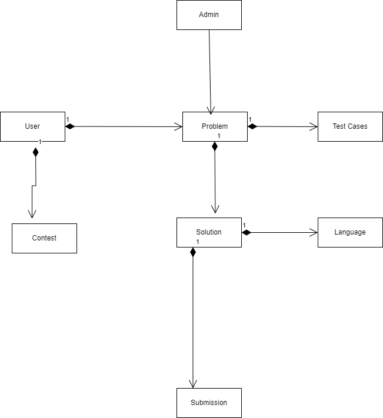

Coding website

Introduction:
This is a comprehensive platform that provides a wide range of coding challenges and interview questions to help you enhance your coding skills and prepare for technical interviews.

Table of Contents:
Features
Contributing
community
Contact

-Features
Large Problem Set: Coding website provides a large problem set encompassing many different subjects, such as shell scripting, databases, algorithms, and more.
Real Interview Questions: Real technical interview questions from leading technology organizations serve as the basis for a large number of the challenges on Coding website.
Discussion Board: Every issue has a dedicated discussion board where people may exchange solutions, talk about various strategies, and get advice from one another.
Contests: Take part in the weekly Coding Website contests to test your skills and pit yourself against other users.

-Contributing
File Structure: Make sure your code is legibly and easily understandable. Make a folder specifically for each issue and name them according to a system that facilitates problem identification.
Language Support: To increase the diversity and accessibility of this repository, please feel free to submit solutions written in a variety of programming languages.
Documentation: To make your thinking process easier for others to grasp, add notes and explanations to your code.
Testing: To verify your solutions, provide test cases whenever possible.

-Community
Connect with the Coding Website community:
Coding Website Discuss
Coding Website Blog

-Contact
If you have any questions, concerns, or feedback, feel free to reach out:
Email: codingwebsite@gmail.com

Every coding challenge is an opportunity to grow, and every contribution you make to this repository helps create a valuable resource for developers.

Object Model is attached below:
