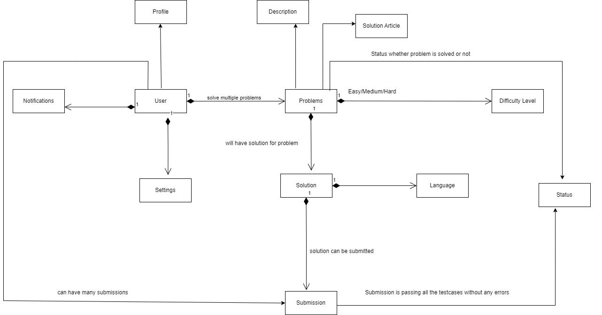

# MonkeyKraft Coders

## Overview

Introduction:
This is a comprehensive platform that provides a wide range of coding challenges to help you enhance your coding skills and prepare for technical interviews.

Table of Contents:
- Features
- Contributing
- Community
- Contact
- Usage
- Installation

## Features

1. **Problem Sets:**
   - Browse a wide range of algorithmic problems categorized by difficulty, topic, and tags.
   - Each problem includes a clear description, example test cases, and constraints.

2. **Coding Playground:**
   - Write and test your code directly on the platform using the built-in code editor.
   - Supports multiple programming languages.

3. **Submission and Evaluation:**
   - Submit your solutions to problems and receive instant feedback on their correctness and efficiency.
   - View detailed execution statistics, such as time and space complexity.

4. **User Profiles:**
   - Create and customize your user profile.

## Contributing

File Structure: Make sure your code is legibly and easily understandable. Make a folder specifically for each issue and name them according to a system that facilitates problem identification.
Language Support: To increase the diversity and accessibility of this repository, please feel free to submit solutions written in a variety of programming languages.
Documentation: To make your thinking process easier for others to grasp, add notes and explanations to your code.
Testing: To verify your solutions, provide test cases whenever possible.

## Contact
If you have any questions, concerns, or feedback, feel free to reach out:
Every coding challenge is an opportunity to grow, and every contribution you make to this repository helps create a valuable resource for developers.

## Usage 
1. Create an account or log in if you already have one.
2. Explore the available problem sets and choose a problem to solve.
3. Use the built-in code editor to write your solution.
4.  Submit your solution and view the feedback provided by the platform.

## Installation
To set up the MonkeyKraft Coders locally, follow these steps:

1. Clone the repository
2. Navigate to the project directory
3. Install dependencies: npm install
4. Set up the database
5. Start the development server on client first and then on server  : npm start
6. Open your browser and navigate to http://localhost:3000 to access the MonkeyKraft Coders Website.

Every coding challenge is an opportunity to grow, and every contribution you make to this repository helps create a valuable resource for developers.

Object Model is attached below:

